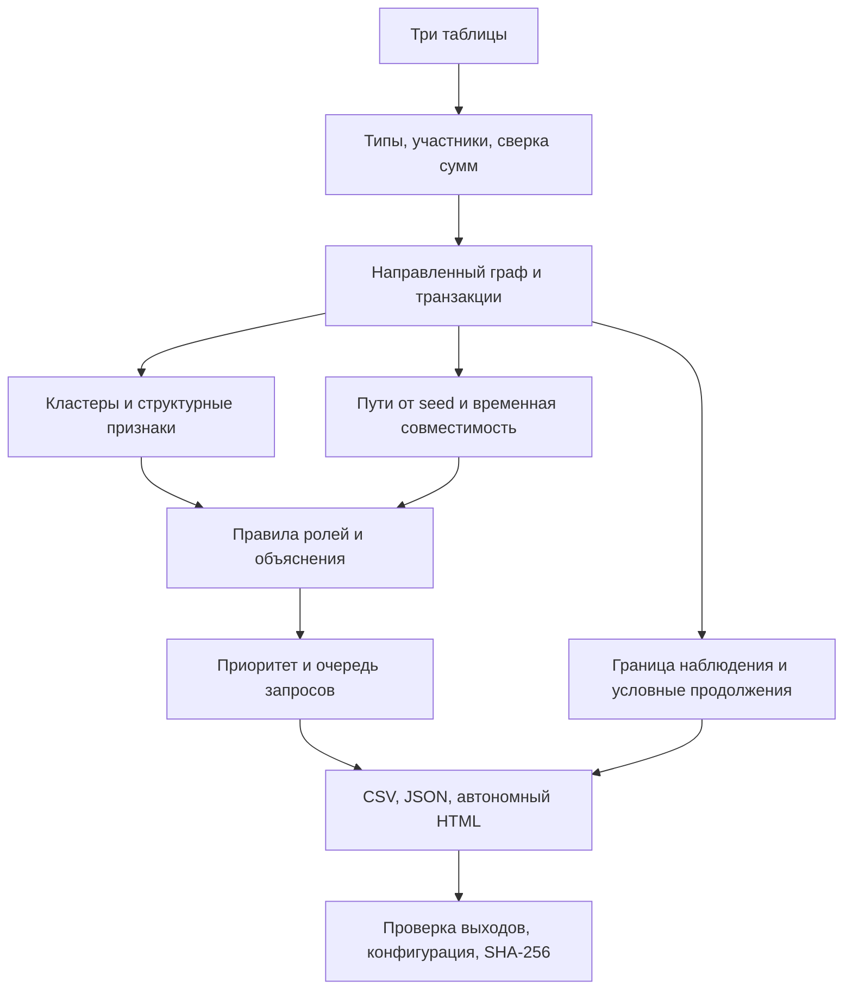

# MoneyGraph — восстановление наблюдаемой финансовой структуры

**Проект для кейса HackAlem AI «Граф денег: восстановление финансовой структуры организованной группы по транзакционной сети».**

MoneyGraph обрабатывает три таблицы переводов и помогает аналитику ответить на вопросы: **кто собирает, передаёт и распределяет средства; какие участники связаны; кого проверять первым; каких данных не хватает для проверки гипотезы.** Для выводов доступны рассчитанные признаки и связанные транзакции.

**Статус версии 1.0.0:** реализованы локальный расчёт, обязательные CSV, автономный интерфейс и автоматические проверки. В комплекте находится **синтетический демонстрационный набор**. Реальные Parquet организаторов ещё не предоставлены, поэтому фактическая структура исходного кейса пока не восстановлена. Качество определения реальных ролей не измерено.

## Навигация

1. [Что решает продукт](#product)
2. [Что судья может увидеть за три минуты](#quick-review)
3. [Технологии и требования](#technology)
4. [Запуск: все шаги](#launch)
5. [Входные данные](#inputs)
6. [Как работает расчёт: десять шагов](#algorithm)
7. [Роли и оценки](#roles)
8. [Результаты и их поля](#outputs)
9. [Как пользоваться интерфейсом](#interface)
10. [Как проверить решение](#verification)
11. [Эксперимент следующего запроса](#experiment)
12. [Подтверждённые результаты и ограничения](#status)
13. [Настройки и структура проекта](#structure)
14. [Типовые ошибки запуска](#troubleshooting)
15. [Порядок сдачи и план команды](#submission)

<a id="product"></a>
## 1. Что решает продукт

### Проблема исходного кейса

Выгрузка содержит клиентов банка и переводы вокруг известных исходных клиентов — `seed`. Отдельная строка перевода не объясняет функцию участника в сети. Нужно объединить переводы, выделить структурные группы, выдвинуть гипотезы о ролях и сформировать обоснованный порядок дальнейшей проверки.

Сложность задачи — неполнота наблюдения. В кейсе использован исходящий обход до четвёртого колена. Исходящие переводы пограничного узла могут отсутствовать в выгрузке из-за способа её построения. Входящие seed также неполны. Эти ограничения влияют на классификацию и объяснения.

### Что получает аналитик

| Вопрос | Результат MoneyGraph |
|---|---|
| Как устроены наблюдаемые связи? | Направленный граф и структурные кластеры |
| Какие функции можно предположить? | Одна основная роль для каждого `gid`, сила правила, альтернативы в JSON |
| Кого изучать первым? | Топ узлов с прозрачным приоритетом и объяснением |
| На чём основан вывод? | Суммы, контрагенты, охват seed, пути, даты и исходные строки переводов |
| Где данных недостаточно? | Маркировка границы, неполноты входящих и конца временного окна |
| Что делать дальше? | Очередь адресных запросов с объяснением недостающих сведений |
| Как передать и повторить результат? | CSV, JSON, автономный HTML, конфигурация и SHA-256 файлов |

Работа с неполнотой — существенная часть продукта. Для подходящих узлов четвёртого колена программа проверяет два условных продолжения графа, которые дают одинаковую наблюдаемую выгрузку. Это показывает, какой вывод пока нельзя установить и зачем нужен дополнительный запрос.

Пользователь продукта — аналитик финансового мониторинга или расследований. Ожидаемая ценность — сокращение ручной подготовки проверяемой карты связей и очереди проверок. Экономию времени предстоит измерить с аналитиками; текущие тесты её не подтверждают.

### Что означает слово «роль»

Роль — **гипотеза о наблюдаемой финансовой функции**. Она не устанавливает вину, незаконность перевода, личность организатора или принадлежность к преступной группе. `gid` — идентификатор вершины. Продукт работает с полями предоставленной выгрузки и не собирает анкетные данные о людях.

<a id="quick-review"></a>
## 2. Что судья может увидеть за три минуты

Для просмотра включённого результата устанавливать Python не требуется.

1. Распакуйте архив целиком и откройте `moneygraph_hackathon/results/demo/dashboard.html` обычным браузером. Это **готовый отчёт**; `moneygraph/dashboard.html` — исходный шаблон, его открывать для демо не нужно.
2. Убедитесь, что виден баннер **«СИНТЕТИЧЕСКИЕ ДАННЫЕ · ДЕМОНСТРАЦИЯ»**. Для включённого примера сверху указаны 2 248 участников, 3 119 направленных связей и 4 840 переводов.
3. В разделе **«Приоритеты проверки»** нажмите любой `gid`. Откроется карточка и автоматически включится **«Окружение 1 шага»**. Изучите гипотезу, признаки, ограничения и переводы.
4. Рассмотрите входящие и исходящие связи выбранного участника. Снимите флажок окружения или нажмите «Сброс», чтобы вернуться к более широкому обзору.
5. Откройте разделы **«Что скрывает граница выгрузки»** и **«Что запросить дальше»**. Первый объясняет неоднозначность, второй предлагает проверяемое действие.
6. Посмотрите `nodes_roles.csv`, `clusters.csv` и `top_nodes.csv` в той же папке. Это обязательные результаты, сформированные тем же расчётом.

Такой просмотр показывает реализацию на инженерном примере. Для проверки исходного кейса выполните запуск на файлах организаторов по следующей инструкции.

<a id="technology"></a>
## 3. Технологии и требования

| Компонент | Технология | Назначение |
|---|---|---|
| Расчёт и команды запуска | Python 3.10+; проверенная среда — 3.12.14 | Загрузка, графовые алгоритмы, роли, экспорт |
| Чтение Parquet | `pyarrow==21.0.0` | Чтение файлов организаторов |
| Структуры графа | `dict`, `set`, `deque` стандартной библиотеки Python | Смежность, обходы и агрегация |
| Методы | BFS, приближённая центральность Brandes, локальная оптимизация модульности, FIFO-сопоставление сумм | Структурные и временные признаки |
| Классификация | Формальные правила и взвешенный приоритет | Воспроизводимые гипотезы и объяснения |
| Интерфейс | HTML, CSS, обычный JavaScript, Canvas 2D | Интерактивная карта и карточки |
| Хранение результатов | CSV, JSON, HTML | Открытые файловые форматы |
| Проверки | Python `unittest`; Node.js `assert` и `vm` | Расчёт, экспорт, JS и модель DOM |
| Воспроизводимость | Фиксированный random seed, JSON-конфигурация, SHA-256 | Повтор расчёта и идентификация файлов |

Для встроенного CSV-демо достаточно Python и стандартной библиотеки. GPU, база данных, сервер и ключи API не требуются. После установки зависимости обработка Parquet также выполняется локально. HTML содержит свои данные, скрипт и стили; внешние CDN и запросы к серверу ему не нужны.

Аналитическое ядро использует графовые методы и правила. Обученной нейросети, GNN и LLM в этой версии нет. Свободно сгенерированные тексты не участвуют в присвоении роли: explanation строится из рассчитанных признаков. Это позволяет показать жюри конкретное условие каждого вывода.

Node.js нужен только для дополнительного теста интерфейса. Для просмотра HTML и расчёта графа он не нужен. Поддержка каждой версии браузера отдельно не проверялась.

<a id="launch"></a>
## 4. Запуск: все шаги

### Шаг 1. Распаковать проект и открыть его корень

Откройте терминал в папке `moneygraph_hackathon`. В текущей папке должны находиться `README.md`, `requirements.txt`, `moneygraph/`, `tests/` и `configs/`.

**Все команды ниже выполняются из этой папки.** Не запускайте их из `moneygraph/` или `results/`. Сначала распакуйте ZIP: запуск непосредственно внутри окна архива не поддерживается.

### Шаг 2. Проверить Python

Для повторения проверенной среды используйте Python 3.12. Проверьте выбранный интерпретатор:

```shell
python --version
```

На Linux/macOS команда обычно называется `python3`. На Windows, если `python` не найден, проверьте установленный Python через `py --version`; используйте доступный интерпретатор при создании окружения.

### Шаг 3. Быстро пересчитать синтетическое демо

Этот шаг не требует установки пакетов. Он создаст новый результат в `results/demo_run`, сохранив включённый в поставку пример:

```shell
python -m moneygraph demo --out results/demo_run --size 2248 --stability
```

Для Linux/macOS замените `python` на `python3`. После успешного завершения команда напечатает JSON с путём результата, числом узлов, `synthetic: true` и временем. Откройте `results/demo_run/dashboard.html`.

Повторный запуск с тем же `--out` обновляет сформированные файлы в этой папке. Для сравнения запусков используйте разные выходные папки.

### Шаг 4. Создать окружение и установить чтение Parquet

**Windows, PowerShell:**

```powershell
python -m venv .venv
.\.venv\Scripts\python.exe -m pip install -r requirements.txt
.\.venv\Scripts\python.exe -c "import pyarrow; print(pyarrow.__version__)"
```

**Linux/macOS:**

```bash
python3 -m venv .venv
./.venv/bin/python -m pip install -r requirements.txt
./.venv/bin/python -c "import pyarrow; print(pyarrow.__version__)"
```

Ожидаемая версия зависимости из requirements — `21.0.0`. Установка требует доступа к источнику Python-пакетов либо заранее подготовленного локального пакета. Активация окружения не требуется: команды прямо указывают его интерпретатор.

**Далее команды приведены для Windows. На Linux/macOS заменяйте `.\.venv\Scripts\python.exe` на `./.venv/bin/python`; остальные аргументы сохраняются.**

### Шаг 5. Поместить реальные входные файлы

Положите файлы организаторов с точными именами:

```text
data/
├── nodes.parquet
├── edges.parquet
└── transactions.parquet
```

Требуются сами таблицы. PDF описывает их структуру, но не содержит полный набор строк. Синтетические CSV уже лежат отдельно в `results/demo/input/`.

### Шаг 6. Выполнить расчёт на настоящих данных

```powershell
.\.venv\Scripts\python.exe -m moneygraph run --data data --out results/real --format parquet --stability
```

При успешном завершении появляются обязательные CSV, отчёт и интерфейс. По умолчанию топ содержит 20 узлов. Для расширенного списка можно передать `--top 50`; при меньшем количестве входных узлов выводятся все доступные.

При ошибке схема или сверка входов могут остановить расчёт. Сообщение начинается с `ОШИБКА:`, код завершения — 2 для обработанных ошибок входа. Старые файлы в выходной папке не следует считать результатом неуспешного запуска; используйте новую папку и проверяйте manifest.

### Шаг 7. Открыть и проверить результат

1. Прочитайте `results/real/validation.json` и предупреждения.
2. Откройте `results/real/dashboard.html` браузером.
3. Сверьте число узлов и переводов с входами, выберите несколько `gid` и выполните проверки из раздела 10.
4. Для полного времени расчёта используйте `runtime_seconds` в `run_manifest.json`. Значение в стандартном выводе CLI фиксируется раньше последней записи файлов и хеширования.

### Дополнительные варианты запуска

Для трёх CSV с такой же схемой:

```powershell
.\.venv\Scripts\python.exe -m moneygraph run --data results/demo/input --out results/csv_check --format csv --stability
```

Для своих порогов:

```powershell
.\.venv\Scripts\python.exe -m moneygraph run --data data --out results/custom --format parquet --config configs/default.json --stability
```

Для справки по параметрам:

```powershell
.\.venv\Scripts\python.exe -m moneygraph --help
.\.venv\Scripts\python.exe -m moneygraph run --help
```

<a id="inputs"></a>
## 5. Входные данные

| Таблица | Обязательные поля | Смысл |
|---|---|---|
| `nodes` | `gid:int64`, `depth:int`, `is_seed:bool` | Все известные участники, включая изолированные узлы |
| `edges` | `src:int64`, `dst:int64`, `sum_kzt:number`, `n_tx:int`, `depth:int` | Агрегированные направленные переводы по парам |
| `transactions` | `src:int64`, `dst:int64`, `date:date/datetime`, `sum_kzt:number` | Отдельные переводы с датами |

`src` — отправитель, `dst` — получатель; `sum_kzt` — сумма в тенге. В CSV поддерживаются ISO-даты и значения `is_seed` как `true/false/1/0`. Лишние поля не используются. `depth` — глубина от исходных узлов; `seed` — исходный участник, заданный входными данными.

Проверяются уникальность `gid`, наличие обоих участников каждого перевода в nodes, уникальность агрегированных пар, положительные конечные суммы, целочисленные счётчики и пригодность дат. По каждой паре `src → dst` агрегат transactions должен совпасть с edges по числу операций и сумме; абсолютный допуск суммы — 0.02 KZT, относительный — 1e-9; применяется больший из двух допусков.

Одинаковые транзакционные строки сохраняются: без исходного идентификатора операции они могут обозначать отдельные переводы. Внутренние `tx-0000001` привязаны к порядку строк конкретного файла. Их нельзя считать банковскими ID или постоянными ID между версиями данных.

**Точность идентификаторов:** при импорте CSV в Excel задавайте `gid`, `src`, `dst` как текст. Excel может округлить длинные целые. В Python идентификаторы остаются целыми, а в JSON/HTML передаются строками.

Файл `metadata.json` может содержать `{"synthetic": true}` для инженерного набора. При работе с реальными файлами не копируйте metadata из демо. Отсутствие синтетического флага само по себе не подтверждает происхождение данных — оно проверяется по фактически использованным входам.

Подробный контракт: [data/README.md](data/README.md).

<a id="algorithm"></a>
## 6. Как работает расчёт: десять шагов



Если просмотрщик не отображает Mermaid, последовательность остаётся такой: **входы → проверка → граф → признаки → роли → приоритеты и запросы → отчёт**.

| Шаг | Что выполняется | Зачем это нужно |
|---|---|---|
| 1. Чтение | Загружаются три таблицы, фиксируются SHA-256 | Привязать выводы к конкретным входам |
| 2. Валидация | Проверяются типы, ссылки, пары, суммы и число операций | Обнаружить несогласованные данные до интерпретации |
| 3. Построение графа | Все nodes становятся вершинами, edges — направленными связями | Сохранить в том числе клиентов без переводов |
| 4. Кластеры | Локальная оптимизация модульности с весами `log(1 + sum_kzt)` | Выделить структурные сообщества и связи между ними |
| 5. Структурные признаки | Контрагенты, суммы, центральность, охват seed и пути | Описать наблюдаемую функцию узла |
| 6. Временные признаки | Сопоставление входов и последующих выходов по дням и объёмам | Проверить временную поддержку транзита |
| 7. Роли | Формальные условия, выбор максимальной силы правила | Получить основную гипотезу и explanation |
| 8. Приоритет и запросы | Взвешенный приоритет; отдельная очередь запросов | Выбрать узлы для изучения и недостающие сведения |
| 9. Неполнота и чувствительность | Учёт границы; условные свидетельства; изменение порогов при флаге | Показать пределы вывода и зависимость от настроек |
| 10. Выгрузка | CSV/JSON/HTML, validation и manifest | Передать проверяемый результат |

### Как считаются важные признаки

- **Охват seed:** BFS находит разные исходные узлы, из которых достижим участник. По умолчанию путь не длиннее четырёх рёбер. Цикл не увеличивает число seed повторно. В JSON сохраняются до трёх примеров структурных путей.
- **Центральность:** направленный невзвешенный Brandes использует воспроизводимую выборку максимум 64 активных источников. Это приближение; сумма перевода не используется как расстояние.
- **Кластеры:** для разбиения учитываются связи обоих направлений как неориентированные; для денежных потоков и вывода стрелок направления сохраняются. Реализована одноуровневая локальная оптимизация, максимум 15 проходов. Изоляты получают свои кластеры. Группа по структуре не доказывает общность преступной деятельности.
- **Время:** FIFO-сопоставление ищет совместимые объёмы через 1–2 дня. Одна входящая сумма не расходуется дважды внутри этого расчёта. Отдельно считается совместимость через 0–2 дня: порядок внутри одного дня неизвестен. Это поддержка гипотезы, а не доказательство движения тех же денежных единиц.
- **Граница:** `depth >= 4` означает границу исходной выборки. Увеличение параметра поиска `max_depth` не снимает это ограничение. В эксперименте с усечением граница определяется отдельно фактом раскрытия узла.
- **Свидетельство неоднозначности:** для подходящего узла без наблюдаемых исходящих создаются два условных графа — без продолжения и с дополнительным исходящим ребром. Программа повторяет обход и проверяет, что наблюдаемая проекция одинакова. Гипотетическое ребро не добавляется к фактическим данным. Выводятся максимум 30 таких примеров; если исходная структура не соответствует проверяемому протоколу обхода, раздел может отсутствовать.

### Небольшой пример для понимания

Условный участник B не является seed и находится на глубине 1. Он получил от A 10 000 KZT 1 июля, затем отправил C 10 000 KZT 2 июля. Других переводов B в этом примере нет.

```text
A ── 10 000 KZT, 1 июля ──► B ── 10 000 KZT, 2 июля ──► C
```

Для B вход = выход, отношение равно 1, а совместимая по времени сумма составляет 100% входа. Условия transit выполнены; другие роли по этим данным не допускаются. При стандартных параметрах сила правила составляет 0.94. Это не «94% вероятности преступления»: число получается из формулы. Приоритет вычисляется отдельно относительно всей сети. Пример иллюстрирует метод и не является результатом реального кейса.

Точные формулы и условия выбора: [docs/METHODS.md](docs/METHODS.md).

<a id="roles"></a>
## 7. Роли и оценки

### Основные правила по умолчанию

| Код роли | Интерпретация | Условие допуска |
|---|---|---|
| `consolidator` | Признаки консолидации средств | Не менее 3 разных плательщиков |
| `distributor` | Признаки распределения | Не менее 5 разных получателей |
| `transit` | Признаки транзита | Не seed, не граница; вход > 0; выход/вход от 0.8 до 1.2; временная поддержка ≥ 0.5 |
| `terminal` | Кандидат в конечные получатели в срезе | Не seed, не граница; вход > 0; выход/вход ≤ 0.1 |
| `coordinator` | Кандидат на координирующую функцию | Охват ≥ 3 seed; ≥ 2 соседних внешних кластеров; положительная центральность с перцентилем ≥ 0.9 |
| `peripheral` | Недостаточно признаков других ролей | Ни одно из перечисленных правил не прошло |

После допуска вычисляется сила каждого подходящего правила. Основной становится роль с максимальной силой; при равенстве используется порядок названий ролей. Альтернативы сохраняются в `report.json`. Наличие всех шести ролей в произвольном наборе не требуется.

У пограничного узла могут сохраняться наблюдаемые признаки консолидации. Однако нулевые исходящие на границе не используются для terminal. Для seed отношение выход/вход не используется для назначения transit или terminal из-за неполных входящих.

### Три разных показателя

| Поле | Что означает | Как интерпретировать |
|---|---|---|
| `role_score` | Нормированная сила выбранного правила, от 0 до 1 | Выраженность признаков конкретной роли по этой формуле |
| `priority_score` | Приоритет проверки, от 0 до 1 | Порядок изучения узлов внутри текущего расчёта |
| `role_retention` | Доля совпадений основной роли в трёх вариантах порогов | Ограниченная чувствительность, при `--stability` |

Ни один показатель не является вероятностью преступления, достоверностью в процентах или вероятностью правильной роли.

### Формула приоритета

```text
priority_score = 0.35 × S + 0.20 × V + 0.20 × B + 0.15 × R + 0.10 × D
```

- `S` — охват seed, делённый на максимальный охват в текущем графе.
- `V` — перцентиль суммы наблюдаемых входов и выходов.
- `B` — перцентиль приближённой центральности.
- `R` — сила основной роли.
- `D` — перцентиль числа разных входящих контрагентов.

Нулевые признаки имеют перцентиль 0; положительные сравниваются с положительными значениями того же признака. Для изолированного узла приоритет равен 0. При изменении весов сумма нормируется на их общий вес. Топ сортируется по убыванию приоритета, затем по числовому `gid`.

Очередь следующих запросов считается отдельно: учитываются приоритет, новый охват seed, ещё не представленный кластер и неопределённость. Поэтому её порядок может отличаться от top_nodes. Запросы формируются как текст; программа не отправляет их автоматически.

<a id="outputs"></a>
## 8. Результаты и их поля

### Обязательные файлы

| Файл | Точные столбцы | Что проверить |
|---|---|---|
| `nodes_roles.csv` | `gid,role,role_score,cluster_id,priority_score,evidence` | Одна строка на каждый входной узел; evidence непустой и ≤ 200 символов |
| `clusters.csv` | `cluster_id,n_nodes,n_seed,sum_kzt_internal,top_gids,hypothesis` | Размеры, seed, внутренний оборот, ведущие gid и гипотеза |
| `top_nodes.csv` | `rank,gid,role,priority_score,why` | По умолчанию 20 участников при наличии ≥ 20 во входе; пояснение каждой позиции |

`top_gids` содержит до пяти идентификаторов через `;`. Внутренний оборот кластера учитывает каждое исходное направленное ребро внутри кластера один раз. Сумма внутренних оборотов всех кластеров может быть меньше общего оборота из-за межкластерных переводов.

### Дополнительные файлы

| Файл | Содержимое |
|---|---|
| `dashboard.html` | Автономный интерфейс с данными текущего запуска |
| `features.csv` | Рассчитанные признаки всех узлов |
| `next_queries.csv` | `gid,reason,request`: очередь следующих запросов |
| `stability.csv` | `gid,base_role,role_retention,scenarios,interpretation`; создаётся с `--stability` |
| `report.json` | Метрики, роли, альтернативы, пути, кластеры, запросы и данные интерфейса |
| `validation.json` | Сохранение узлов, сверка агрегатов, допустимость оценок, объяснений и границы |
| `run_manifest.json` | Версия программы/Python, параметры, время, признак синтетики, SHA-256 входов и выходов |

`report.json` содержит до 100 транзакций на узел, отсортированных по дате и служебному ID; это ограниченное представление. Полный список остаётся во входной таблице. HTML показывает выбранные поля отчёта; расширенные признаки доступны в JSON/CSV.

CSV записываются с UTF-8 BOM. JSON встраивается в HTML с экранированием `<`, чтобы содержимое поля не могло закрыть блок данных. Результаты содержат сведения исходной выгрузки: передавайте их в рамках разрешённого использования данных кейса.

<a id="interface"></a>
## 9. Как пользоваться интерфейсом

1. **«Точный gid» → «Найти».** Вставьте идентификатор полностью. При совпадении открывается карточка; конфликтующие фильтры сбрасываются. Неизвестный gid даёт сообщение «не найден в отчёте»; предыдущая карточка может оставаться открытой.
2. **«Роль» и «Кластер».** Фильтры пересекаются: отображаются участники, соответствующие обоим условиям. В текущем интерфейсе consolidator/coordinator указаны кодами, остальные роли имеют русские подписи.
3. **«Окружение 1 шага».** После выбора участника показывает его и непосредственных соседей. Снимите флажок для широкого обзора. При выборе из таблицы приоритетов режим включается автоматически.
4. **Карта.** Стрелка идёт от отправителя к получателю. Колесо и кнопки `+`/`−` меняют масштаб; перетаскивание перемещает карту. «Вписать» показывает отфильтрованные узлы целиком. «Сброс» очищает выбор и фильтры.
5. **Карточка.** Сопоставьте «Наблюдаемые показатели», «Основания гипотезы», ограничения, «Наблюдаемые пути» и «Переводы в карточке». «Показать ещё» раскрывает дополнительные записи. Наблюдаемый вход минус выход не означает реальный остаток счёта.
6. **«Кластеры сети».** Нажмите кластер, чтобы перейти к его участникам. Это действие сбрасывает фильтр роли и режим окружения. Интерпретируйте гипотезу как структурное описание.
7. **«Что запросить дальше».** Проверьте соответствие запроса пробелу в карточке: исходящие за границей, полные входящие, следующий период или уточнение времени.
8. **«Качество данных и ограничения».** Прочитайте предупреждения перед выводами по сети.

На плотном графе начинайте с точного поиска и окружения одного участника. HTML представляет уже рассчитанный отчёт. Для загрузки другой выгрузки, пересчёта порогов и генерации новых CSV используйте CLI.

<a id="verification"></a>
## 10. Как проверить решение

### A. Проверка алгоритмов и экспорта

После установки зависимости выполните:

```powershell
.\.venv\Scripts\python.exe -m unittest discover -s tests -v
```

В текущем наборе 27 тестов. При установленном pyarrow ожидается выполнение всех 27. Если он отсутствует, тест Parquet будет явно пропущен: `OK (skipped=1)` подтверждает только остальные проверки. Пропуск нужно указывать в отчёте о запуске.

Проверяются изоляты, int64, сверка входов, одинаковые транзакции, правила seed/границы, порядок дней, повторное использование суммы, циклы, воспроизводимость CSV, схемы выгрузок, встраивание JSON и небольшой эксперимент раскрытия.

### B. Проверка логики интерфейса

При установленном Node.js:

```shell
node tests/test_dashboard.cjs
```

По умолчанию проверяется включённый `results/demo/dashboard.html`. Для нового результата:

```shell
node tests/test_dashboard.cjs results/real/dashboard.html
```

Ожидается `PASS: 9 checks`. Это запуск JavaScript с моделью DOM: проверяются поиск, int64, фильтры, окружение и сброс. Реальная отрисовка Canvas и расположение элементов проверяются вручную браузером.

### C. Проверка выходных файлов

Распечатайте отчёт проверки:

```powershell
.\.venv\Scripts\python.exe -m json.tool results/real/validation.json
.\.venv\Scripts\python.exe -m json.tool results/real/run_manifest.json
```

Судья или разработчик проверяет каждое условие отдельно:

- `all_nodes_preserved`, `edges_reconcile_transactions`, `all_evidence_valid`, `scores_finite_and_in_range` равны `true`.
- `boundary_terminal_count` равен 0.
- Число строк nodes_roles без заголовка равно числу узлов во входном nodes, включая изоляты.
- Заголовки трёх обязательных CSV совпадают с разделом 8.
- Топ содержит 20 строк при ≥ 20 входных узлах и стандартном `--top`; приоритеты идут по убыванию.
- Сумма `n_nodes` в clusters равна общему числу узлов.
- В manifest сохранены ожидаемые настройки, входные хеши и время данного запуска. Проверка времени «до 5 минут» на реальном входе выполняется здесь.
- В предупреждениях нет неразобранного отклонения схемы/периода. Поле `valid` не заменяет чтение отдельных показателей и предупреждений.

### D. Ручная проверка произвольного участника

Пусть жюри выберет `gid` из входного nodes, а не из заранее подготовленного списка.

1. Найдите этот gid в интерфейсе и в nodes_roles.
2. В исходном transactions отберите строки, где `dst = gid`: сумма должна совпасть с `in_kzt` в features. Аналогично строки `src = gid` дают `out_kzt`.
3. Посчитайте разных плательщиков и получателей, исключив переводы самому себе при подсчёте контрагентов. Сравните `in_degree`/`out_degree`.
4. Откройте правило назначенной роли из раздела 7 и точную формулу METHODS. Проверьте условия по features. Для transit дополнительно проверьте даты и временно совместимую сумму.
5. Для примера пути из `report.json` проверьте наличие каждой пары отправитель → получатель в edges. Путь подтверждает структурную достижимость; порядок переводов по всей цепочке нужно рассматривать отдельно.
6. Сопоставьте `evidence`, роль и ограничения. Если показан следующий запрос, назовите, какое неизвестное обстоятельство он должен проверить.

### E. Обязательные пограничные сценарии

| Сценарий | Как выбрать | Ожидаемое поведение |
|---|---|---|
| Изолированный seed | В features: `is_seed = True`, `n_tx = 0` | Узел сохранён, peripheral, priority_score = 0, отдельный кластер |
| Узел четвёртого колена | В features: `depth >= 4` | `boundary = True`; роль terminal не назначена по отсутствию исходящих |
| Seed с неполными входящими | Подходящий seed с переводами | Отношение выход/вход не назначает transit или terminal |
| Вход и выход в один день | Тест `test_same_day_does_not_prove_order` | Совпадение даты отдельно от строгой временной поддержки |
| Неизвестный gid | Идентификатор, которого нет в nodes | Сообщение об отсутствии |
| Разные фильтры | Выбрать роль и кластер | Пересечение; при пустом пересечении — сообщение о пустом результате |

Если сценария нет в реальной выгрузке, покажите соответствующий автоматический тест. Не добавляйте искусственный пример в реальные результаты.

### F. Проверка повторяемости

Запустите один вход с одной конфигурацией в две разные папки:

```powershell
.\.venv\Scripts\python.exe -m moneygraph run --data data --out results/repeat_a --format parquet --stability
.\.venv\Scripts\python.exe -m moneygraph run --data data --out results/repeat_b --format parquet --stability
```

Обязательные CSV должны совпасть побайтно. В PowerShell можно сравнить их SHA-256:

```powershell
Get-FileHash results/repeat_a/nodes_roles.csv, results/repeat_b/nodes_roles.csv
Get-FileHash results/repeat_a/clusters.csv, results/repeat_b/clusters.csv
Get-FileHash results/repeat_a/top_nodes.csv, results/repeat_b/top_nodes.csv
```

На Linux/macOS используйте имеющуюся утилиту SHA-256 или сравнение файлов. JSON/HTML и manifest могут отличаться временем выполнения и моментом генерации; это не нарушение повторяемости аналитических CSV. После изменения входа или конфигурации совпадение результата уже не ожидается.

<a id="experiment"></a>
## 11. Эксперимент следующего запроса

Это дополнительная проверка способа выбора узлов для раскрытия. Для синтетического набора:

```powershell
.\.venv\Scripts\python.exe -m moneygraph benchmark --data results/demo/input --format csv --out results/benchmark_run --budget 10 --random-runs 3
```

Для настоящей выгрузки:

```powershell
.\.venv\Scripts\python.exe -m moneygraph benchmark --data data --format parquet --out results/benchmark_real --budget 10 --random-runs 3
```

Последовательность эксперимента:

1. Полный предоставленный файл становится эталоном **внутри эксперимента**.
2. Из него создаются наблюдения с обрывом после второго и третьего колена. Попадают переводы только раскрытых отправителей; известные seed сохраняются.
3. На каждом шаге стратегия выбирает доступный для раскрытия узел. Скрытые суммы и степени не участвуют в выборе.
4. Раскрываются доступные в полном файле исходящие этого узла. Узлы исходной четвёртой границы не трактуются как узлы с известным пустым ответом.
5. С одинаковым бюджетом сравниваются приоритет с новым охватом seed, входящая сумма, число плательщиков и случайный выбор с тремя повторами.
6. После каждого шага пересчитываются показатели. Для эталона и частичных графов используется одна конфигурация: 16 источников центральности и 8 проходов кластеризации.

Выходы: `disclosure_benchmark.csv` — шаги; `benchmark_summary.json` — итоги. `recall_at_20` показывает долю участников эталонного топа, попавших в текущий топ. `queries_to_90pct = null` означает, что 90% не достигнуты. Это не accuracy преступных ролей. `normalized_auc` усредняет пересечение топов по бюджету; рост отражает более раннее восстановление эталонного топа.

Экспериментальная стратегия учитывает приоритет и новый охват seed. Пользовательская очередь next_queries также учитывает новый кластер и неопределённость. Эксперимент не является полной валидацией всех факторов пользовательской очереди.

<a id="status"></a>
## 12. Подтверждённые результаты и ограничения

### Результаты включённого прогона от 23 сентября 2026 года

| Проверка | Фактический результат |
|---|---|
| Среда расчёта | Windows 11, Python 3.12.14 |
| Синтетический вход | 2 248 узлов, 3 119 рёбер, 4 840 транзакций, 81 seed |
| Сохранение узлов | Все узлы, включая 19 изолированных seed |
| Объяснения | Все непустые, ≤ 200 символов |
| Защита границы | 444 узла на границе; 0 назначений terminal на границе |
| Полное время демо | 2,1823 секунды по включённому manifest |
| Python | 26 тестов прошли; 1 тест Parquet пропущен |
| JavaScript/DOM | 9 проверок прошли |
| Проверка раскрытия | 12 комбинаций обрыва, стратегии и повтора |

Время демо включает генерацию инженерных CSV, чтение, анализ, выгрузки, HTML и хеширование; исключает финальную запись manifest. Это один прогон на синтетике. На другом компьютере и реальном входе время нужно измерить заново.

В эксперименте при бюджете 10 запросов пересечение с эталонным топом после обрыва на втором колене составило: приоритет — 15%, сумма — 15%, степень — 10%, случайный выбор — 15% в каждом из трёх повторов. После третьего колена: 25%, 20%, 20% и 20% соответственно. Ни одна стратегия не достигла 90%; отличие на третьем колене — один участник из двадцати. Один синтетический набор не подтверждает устойчивое преимущество.

Журналы: [docs/VALIDATION.md](docs/VALIDATION.md), `results/checks/`, `results/demo/run_manifest.json`, `results/benchmark/`.

### Что ещё нужно подтвердить

- **Реальный кейс:** исходные Parquet отсутствуют. Конкретные реальные роли, кластеры и топ пока не получены.
- **Parquet:** адаптер реализован; roundtrip в среде подготовки пропущен, потому что pyarrow отсутствует. Сетевая установка не завершилась, а автоматическая проверка разрешений отклонила повышение прав. Проверку нужно повторить после установки зависимости на машине команды.
- **Браузер:** среда подготовки запретила открытие локального HTML. Выполнены проверки JavaScript/DOM без браузера; отрисовку, Canvas и удобство интерфейса нужно проверить вручную.
- **Предметное качество:** размеченных истинных ролей нет. Вычислительные тесты проверяют реализацию, но не доказывают правильность гипотез о людях или организациях.
- **Масштаб:** версия предназначена для объёма кейса. Производительность на миллионе узлов не проверена; план изменения хранения и алгоритмов описан в ROADMAP.

### Ограничения интерпретации

Наблюдается один банк, ограниченный период и переводы от порога кейса. Переводы за границей, в другие банки, в другие даты и меньших сумм могут быть неизвестны. Общий оборот графа включает несколько звеньев и не равен преступному доходу. Структурный путь и временная совместимость не доказывают происхождение тех же денег. Высокая центральность не доказывает управление группой. Кластер не равен доказанной организованной группе.

<a id="structure"></a>
## 13. Настройки и структура проекта

Все параметры по умолчанию находятся в `configs/default.json` и `DEFAULTS` в engine.py. В JSON можно переопределить нужные поля; неизвестные названия отклоняются.

| Группа | Параметры | Что меняется |
|---|---|---|
| Роли | `consolidator_in`, `distributor_out`, `coordinator_seeds`, `coordinator_external_clusters`, `coordinator_centrality` | Условия допуска к ролям |
| Время и поток | `transit_min`, `transit_max`, `transit_temporal`, `terminal_ratio`, `temporal_days` | Отношение потоков и окно совместимости |
| Поиск и граф | `max_depth`, `centrality_sources`, `community_resolution`, `community_iterations`, `random_seed` | Поиск путей, приближение центральности и кластеры |
| Приоритет | `priority_weights` | Пять весов в порядке seed, объём, центральность, роль, плательщики |

`--stability` проверяет три набора порогов с коэффициентами 0.8, 1.0 и 1.2 для части правил. Метрики и кластеры фиксированы. Это не повторное обучение, не доверительный интервал и не проверка всех видов пропусков.

```text
moneygraph_hackathon/
├── README.md                    # Этот документ: запуск и приёмка
├── requirements.txt             # pyarrow для Parquet
├── pyproject.toml               # Метаданные пакета и CLI
├── AGENTS.md                    # Правила сохранения корректности
├── configs/default.json         # Пороги и веса
├── data/README.md               # Контракт входов; сюда кладутся Parquet
├── moneygraph/
│   ├── __main__.py              # Команды demo, run, benchmark
│   ├── data.py                  # Чтение и сверка таблиц
│   ├── engine.py                # Признаки, роли, кластеры, запросы
│   ├── pipeline.py              # Формирование выходов и manifest
│   ├── experiments.py           # Контролируемое раскрытие сети
│   ├── synthetic.py             # Генератор инженерного примера
│   └── dashboard.html           # Шаблон интерфейса
├── tests/
│   ├── test_moneygraph.py       # Python-проверки
│   └── test_dashboard.cjs       # JS/DOM-проверки
├── scripts/                     # Дополнительные команды запуска демо
├── docs/                        # Формулы, архитектура, передача и защита
└── results/
    ├── demo/                    # Готовый синтетический отчёт и входы
    ├── benchmark/               # Включённый эксперимент
    └── checks/                  # Логи выполненных проверок
```

Документы для детального разбора:

- [METHODS](docs/METHODS.md) — точные формулы и методы.
- [SPEC_MAP](docs/SPEC_MAP.md) — сопоставление с требованиями PDF.
- [CODER_HANDOFF](docs/CODER_HANDOFF.md) — действия разработчика после получения файлов.
- [REVIEW](docs/REVIEW.md) — разбор требований и рисков интерпретации.
- [IDEAS_REVIEW](docs/IDEAS_REVIEW.md) — объединение идей и границы объёма продукта.
- [VALIDATION](docs/VALIDATION.md) — измеренные результаты и пропуски проверок.
- [PITCH](docs/PITCH.md) — предметная защита на пять минут.
- [ROADMAP](docs/ROADMAP.md) — распределение пяти часов и развитие масштаба.
- [PRODUCT](docs/PRODUCT.md) — коммерческая гипотеза и метрики пилота.
- [architecture.mmd](docs/architecture.mmd) — схема архитектуры для слайда.

<a id="troubleshooting"></a>
## 14. Типовые ошибки запуска

| Симптом | Причина и действие |
|---|---|
| `python` не найден | Проверить установку Python; на Windows попробовать `py`, на Linux/macOS — `python3` |
| `No module named moneygraph` | Открыть терминал в корне распакованного проекта, где находится папка moneygraph |
| Сообщение об установке зависимости для Parquet | Установить requirements тем же интерпретатором `.venv`, которым запускается расчёт |
| Установка пакета не проходит | Проверить доступность источника пакетов; временно можно проверять CSV-демо без сторонних библиотек |
| Не найден входной файл | Проверить `--data`, расширения и точные имена трёх файлов |
| Неполный набор Parquet в режиме auto | Добавить недостающие файлы либо явно выбрать `--format csv` для полного CSV-набора |
| `edges/transactions не согласуются` | Проверить, что файлы относятся к одной выгрузке; сверить сумму и число операций указанной пары |
| Ошибка gid или округлённый идентификатор | Вернуться к исходному файлу; не преобразовывать int64 через float/числовой импорт Excel |
| HTML сообщает ошибку встроенного отчёта | Открыть сформированный `results/.../dashboard.html`, а не шаблон из moneygraph |
| Граф пуст после фильтрации | Проверить пересечение фильтров; нажать «Сброс» и выполнить точный поиск |
| Раздел границы отсутствует | Для текущего входа не построены проверенные свидетельства; посмотреть ограничения и структуру данных |
| Тесты закончились `OK (skipped=1)` | Прочитать причину пропуска; установить pyarrow для выполнения Parquet roundtrip |
| Интерфейс показывает прежние данные | Проверить выходную папку, успешность запуска и дату manifest; обновить страницу |

<a id="submission"></a>
## 15. Порядок сдачи и план команды

### Приёмка перед передачей судьям

- [ ] Три реальных файла получены и их происхождение проверено.
- [ ] Зависимость установлена; Parquet-тест выполнен без пропуска.
- [ ] Чистый запуск завершён; время на реальном входе зафиксировано в manifest.
- [ ] Три обязательных CSV имеют нужные поля и сохраняют всех узлов.
- [ ] Прочитаны validation и предупреждения; проверены несколько произвольных gid.
- [ ] Проверены изолированный seed и узел границы либо показаны соответствующие тесты.
- [ ] HTML открывается браузером; работают поиск, фильтры, стрелки, карточки и окружение.
- [ ] Результат настоящего кейса сохранён отдельно от синтетического демо.
- [ ] В сдачу включены исходники, конфигурация, README, схема и результаты; разрешения на передачу самих данных соблюдены.
- [ ] На защите указаны фактически выполненные и оставшиеся проверки.

### Пять часов после получения данных

| Период | Работа | Результат |
|---|---|---|
| 0:00–0:30 | Установка, схема, сверка входов, первый запуск | Данные читаются без скрытых исправлений |
| 0:30–1:30 | Проверка ролей и топа по исходным строкам | Обоснованные обязательные CSV |
| 1:30–2:30 | Проверка браузера и произвольных gid | Рабочий сценарий аналитика |
| 2:30–3:30 | Чувствительность и эксперимент при доступном времени | Фактические сравнительные результаты |
| 3:30–4:15 | Повторный запуск, документация, упаковка | Воспроизводимая сдача |
| 4:15–5:00 | Репетиция предметной защиты | Объяснение задачи, методов, результатов и ограничений |

Для команды из 3–4 человек задачи распределяются между данными/алгоритмами, интерфейсом, проверками/документами и экспериментом/предметным разбором.

### Что показать на защите

1. Фактические входы, один запуск и три обязательных результата.
2. Выбранный жюри `gid`: исходные переводы → признаки → правило роли → приоритет.
3. Узел на границе: какое утверждение пока не установлено и какие сведения нужны.
4. Следующий запрос и, если выполнен, результат сравнения стратегий на этом файле.
5. Время, пройденные проверки, ограничения и следующий измеримый этап развития.

**Критерий готовности решения кейса:** работа программы подтверждена на предоставленных организаторами таблицах, результаты проверяемы по исходным строкам, обязательные артефакты сформированы, оставшаяся неопределённость явно описана.
