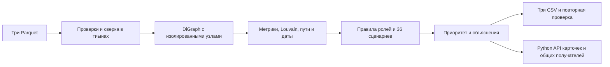

# След — навигатор финансового расследования

Локальное аналитическое ядро кейса Freedom Bank, HackAlem AI, трек «Финансы».
Из трёх Parquet-файлов строит направленный граф, определяет объяснимые роли,
сообщества и приоритеты проверки. Формирует CSV, раскрывает основания каждого
вывода и проверяет чувствительность ролей к порогам.

Все выводы — гипотезы для аналитика. Оценки не являются вероятностью преступления.
В текущей версии реализованы Python API и CLI; веб-интерфейса пока нет.

## Запуск

Python 3.12 или новее. Подготовка окружения выполняется один раз:

```bash
python -m venv .venv
# Windows PowerShell:
.venv\Scripts\Activate.ps1
# Linux/macOS: source .venv/bin/activate
python -m pip install -r requirements.txt
```

Положите `nodes.parquet`, `edges.parquet`, `transactions.parquet` в `data/`.
Полный запуск после установки зависимостей:

```bash
python main.py
```

В корне проекта появятся `nodes_roles.csv`, `clusters.csv`, `top_nodes.csv`.
Пути по умолчанию вычисляются относительно `main.py`, а не текущего каталога.
Данные не скачиваются, сетевые вызовы и API-ключи не используются.
Установка зависимостей не входит во время расчёта; импорт библиотек, проверка
входных файлов, расчёт, экспорт и повторная проверка CSV входят.

```bash
python main.py --data /path/to/data --out /path/to/output
python main.py --explain 100000003115284100
python main.py --common 100000003115284100 100000004015047100
python -m unittest discover -s tests -v
```

`--explain` печатает JSON с четырьмя блоками карточки, формулами, результатами
проверки правил, вкладами в приоритет, сценариями устойчивости, путями и всеми
операциями узла. `--common` принимает любые существующие ID: у выбранной пары
общих получателей может не быть. Оба режима также создают CSV.

Коды завершения: `0` — успех и время <60 с; `1` — ошибка входа/расчёта/вывода;
`2` — отсутствует зависимость или неверны CLI-аргументы; `3` — расчёт корректен,
но занял >=60 с. При ошибке `--debug` выводит traceback.

## Архитектура



`analytics_core.py` содержит расчёт и функции для будущего интерфейса.
`main.py` отвечает за аргументы, диагностику и время выполнения.
Используются pandas, NumPy, NetworkX, SciPy и PyArrow.
LLM, GPU, база данных и внешние источники не требуются.

## Контракт и проверка данных

- `nodes`: `gid` int64, `depth` от 0 до 4, `is_seed` bool; depth=0 соответствует seed.
- `edges`: уникальные пары `src/dst`, сумма `sum_kzt`, положительный `n_tx`, depth 1–4.
- `transactions`: `src`, `dst`, календарная `date`, положительная `sum_kzt` от 5 000 ₸.
- ID должны быть целочисленными; float-ID отклоняются до потери точности.
- Суммы переводятся в целые тиыны; проверяются точность, знак и переполнение.
- Каждая пара в edges сверяется с суммой и количеством транзакций.
- Равные строки транзакций сохраняются: это могут быть отдельные операции.
- Все узлы добавляются в граф, даже если переводов по ним нет.
- Граф строится из transactions; edges служит независимой проверкой агрегации.
- 2 248 — размер данного набора, а не зашитый ответ. Для небольших тестовых графов
  топ содержит min(20,N).

## Метрики

`in_degree/out_degree` — число направленных соседей. `in_amount/out_amount`
(также `in_volume/out_volume`) — наблюдаемые суммы в KZT. `net_flow = in_amount -
out_amount` — разность видимых потоков, не остаток счёта.

Для правил используются `in_partners/out_partners` и суммы без петель на самого
себя. Если входа нет, `pass_through=0` является только заполнителем:
`pass_through_defined=false`, и балансовые роли запрещены.

- PageRank: направленный граф, вес в KZT, alpha=0.85, tol=1e-10.
- Betweenness: направленные кратчайшие пути по числу переходов, без весов сумм.
  При N>128 используется выборка 128 источников, seed=42; иначе точный расчёт.
  Большая сумма не трактуется как большая длина пути. Метрика приближённая.
- HITS: степенные итерации на взвешенной разреженной матрице SciPy CSR;
  hubs и authorities нормируются отдельно к сумме 1. Начальный вектор равномерный,
  предел 10 000 итераций, точность L1=1e-10. При кратном максимальном сингулярном
  значении выбор решения определяется фиксированным начальным вектором.
- Louvain: неориентированная проекция только для сообществ; встречные суммы
  складываются, seed=42. Каждый изолированный узел образует своё сообщество.
- `seed_reach`: число разных исходных узлов, из которых достижим этот узел
  по направлению переводов за <=4 перехода. Сам узел не считается своим источником.
- `seed_paths`: до трёх примеров кратчайших путей. API хранит по одному кратчайшему
  пути от каждого доступного seed. Все возможные маршруты не перечисляются.
- `cross_cluster_count`: число других сообществ среди непосредственных соседей.

Для временного признака исходящий объём сопоставляется FIFO с ещё не использованным
входящим объёмом за предыдущие 1–2 календарных дня. Каждая единица объёма используется
максимум один раз. Переводы в один день не упорядочиваются и не сопоставляются.
`temporal_in_share` и `temporal_out_share` — доли такого объёма во входе и выходе.
Это проверка совместимости по времени, не доказательство движения тех же денег.

## Роли и формальные правила

`role` — машинный код, `role_label` — русское название. Словарь включает шесть
ролей из ТЗ и расширение `source` для запрошенной роли «Источник / Дроп».
Наличие seed само по себе не доказывает роль дропа и не отменяет структурные роли.

Правила проверяются в следующем порядке; выбирается первое выполненное.
Все выполненные правила доступны в `explain_node`, даже если выбрана другая роль.

| Код | Название | Правило |
|---|---|---|
| coordinator | Координирующий узел | seed_reach>=3; связи с >=2 другими кластерами; betweenness>0 и >=90-го процентиля положительных значений; >=2 отправителей и >=2 получателей; не граница |
| distributor | Веерный распределитель | >=10 получателей; out_partners/max(in_partners,1)>=2 |
| transit | Транзитный узел | Не seed и не граница; есть вход и выход; abs(out/in-1)<=0.2; обе временные доли >=0.5 |
| consolidator | Агрегатор / Сбор | >=3 отправителей; out/in<=0.5, если баланс применим; для seed/границы используются только входящие связи |
| terminal | Накопитель / Касса | Не seed и не граница; положительный вход; out/in<=0.1 |
| source | Источник / Дроп | is_seed=true и есть исходящие другим узлам; специальные правила выше не сработали |
| peripheral | Недостаточно признаков | Остальные узлы, включая изолированные |

Сборщик с несколькими отправителями имеет приоритет над накопителем. Узлу с
неоднозначными признаками не навязывается одна из четырёх активных ролей.
Всем depth=4 добавляется точная пометка:
**Дальнейшие переводы не наблюдаются (граница горизонта 4 колен)**.
Граничным узлам никогда не присваиваются transit/terminal. Они могут иметь признаки
сбора по входящим связям, но это ничего не говорит об удержании денег.

### Сила роли

`score = role_score` — эвристическая сила подтверждающих признаков:

| Роль | Формула до ограничений |
|---|---|
| coordinator | 0.50 + 0.35 * min(seed_reach/10,1) |
| distributor | 0.50 + 0.35 * min(out_partners/50,1) |
| consolidator | 0.45 + 0.35 * min(in_partners/10,1) |
| transit | 0.50 + 0.35 * min(temporal_in_share,temporal_out_share) |
| terminal | 0.55 + 0.20 * (1-min(pass_through,1)) |
| source | 0.50 |
| peripheral | 0.15 |

На границе score ограничен 0.40; для seed-сборщика — 0.55.
При отсутствии разметки эта оценка не калибрована как вероятность точности.

### Чувствительность

Восемь численных порогов `Thresholds` меняются по одному на -20%, -10%, +10%, +20%
(32 сценария), а затем все совместно (4 сценария). `stability_score` — доля из 36
сценариев, сохранивших исходную роль. Возвращаются альтернативные роли и перечень
сценариев со сменой результата. Значение 1 не означает доказанную правильность.

Перцентиль betweenness, структура сообществ, seed, горизонт и порядок правил
фиксированы. Это чувствительность порогов, а не устойчивость к удалению операций,
изменению периода или неполноте данных.

### Приоритет проверки

```text
base = 0.30*N(seed_reach)
     + 0.20*N(in_amount+out_amount)
     + 0.15*N(max(in_partners,out_partners))
     + 0.15*N(betweenness_centrality)
     + 0.10*N(page_rank)
     + 0.10*N(authority_score)
priority_score = base * boundary_factor * (0.75+0.25*stability_score)
```

Для первых трёх признаков `N(x)=log1p(x)/max(log1p(x))`, для центральностей
`N(x)=x/max(x)`. Нулевой максимум даёт 0. `boundary_factor=0.7` на четвёртом
колене и 1 иначе. У узлов без связей с другими участниками приоритет 0.
HITS hub рассчитывается и объясняется, но не дублируется в итоговом приоритете.
Сортировка: priority_score по убыванию, затем точный gid по возрастанию.
Это относительный приоритет внутри предоставленной выборки, не степень виновности.

## CSV и программный интерфейс

CSV записываются в UTF-8 с BOM. Дополнительные поля сохраняют совместимость с ТЗ.

- `nodes_roles.csv`: запрошенные `gid, role, score, explanation, limitation,
  next_step`; дополнительно `role_label, role_score, cluster_id, priority_score,
  evidence` (<=200 символов), все метрики, пути и устойчивость. Четыре блока:
  `hypothesis, explanation, limitation, next_step`.
- `clusters.csv`: `cluster_id, node_count, total_volume, dominant_role, description`;
  также `n_nodes, n_seed, sum_kzt_internal, top_gids, hypothesis`.
  `total_volume` — сумма внутренних направленных переводов, каждый учтён один раз.
  Межкластерные переводы в этот показатель не входят.
- `top_nodes.csv`: 20 лидеров с `rank, gid, role, priority_score, why` и карточкой.

```python
from analytics_core import analyze, find_common_recipients, explain_node

result = analyze("data")
sources = [gid for gid, attrs in result.graph.nodes(data=True) if attrs["is_seed"]]
common = find_common_recipients(result, sources, min_sources=2)
card = explain_node(result, int(result.top_nodes.iloc[0]["gid"]))
```

Общие получатели находятся по направлению рёбер в пределах четырёх переходов
от каждого источника. Сами выбранные источники исключаются из ответа.
JSON API передаёт ID строками: все ID реального набора превышают точность JS Number.
В CSV ID — полные десятичные целые; в Excel импортируйте столбец как текст.
`transaction_ref=row:N` — номер строки исходного Parquet, не банковский ID операции.

CSV сначала записываются во временные файлы и повторно читаются. Проверяются
все ID, заполненность, конечность чисел, диапазоны скорингов, ограничения границы,
размеры кластеров и порядок топа. После проверки каждый файл заменяется атомарно.
Замена трёх файлов не является единой файловой транзакцией; при блокировке CSV
другой программой завершите её работу и повторите запуск.

## Ограничения и проверка качества

Размеченных ролей нет: accuracy/precision не заявляются. Размеры, суммы, направления,
даты, правила и пояснения проверяются независимо. В тестах есть синтетические
примеры транзита, обрыва, изолированных узлов, повторных операций, неверных сумм,
небезопасных ID и детерминизма.

Не видны межбанковские переводы, суммы ниже 5 000 ₸, полные входящие потоки,
остатки, операции вне периода и продолжение за горизонтом. Координатор графа
не равен организатору преступления. Нет клиентских атрибутов или обогащения.
Фактические числа вычисляются; расхождения с описанием набора не скрываются.

Данные и CSV исключены из Git по правилам приватности: передайте их жюри только
по разрешённому организаторами каналу. Каталог `.runtime-deps/` — локальная
особенность среды разработки, не часть запуска продукта.

## Масштабирование до миллиона узлов

NetworkX заменяется на igraph/NetworKit или распределённый движок; вход агрегируется
порциями Arrow/DuckDB. PageRank/HITS считаются на разреженных матрицах, betweenness
остаётся выборочным. Пути строятся по запросу с ограничением результата: хранить BFS
для каждого seed нельзя при их большом числе. Временные признаки считаются по
отсортированным партициям клиента. Интерфейсу передаются локальные подграфы.
